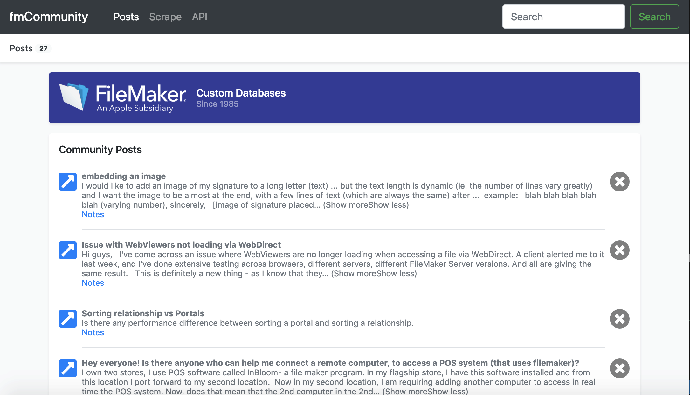

# fmCommunity

### Overview

This project uses Mongoose and Cheerio to scrape the latest forum posts from the FileMaker community website and save the basic info (along with links to the original articles) to a responsive web application and Mongo Databse for users to then easily peruse and search through.

### Project Objectives

   1. Scrape Articles from a website of my choosing. I chose https://community.filemaker.com/community/discussions

   2. Save the articles to a No-SQL Database using Mongo DB and Mongoose

   3. Allow users to add notes to an article, as well as have the option to delete such notes, update or add to these notes or even delete the entire article itself.

### Technology Used

   * [Node.js](https://nodejs.org/en/) - for Javascript based server code and logic
   * [Express](https://expressjs.com/) - companion Web Framework for node.js
   * [Express-handlebars](https://www.npmjs.com/package/express-handlebars) - A handlebars express engine for node.js. Also see the Handlebarsjs documentation [here](https://handlebarsjs.com/).
   * [MongoDB](https://docs.mongodb.com/manual/) - An open-source no-SQL database for collecting and storing data.
   * [Mongoose](http://mongoosejs.com/docs/api.html) - A tool to provide some structure to MongoDB that works well with Node.js
   * [Cheerio](https://github.com/cheeriojs/cheerio) - A fantastic Javascript website scraping and parsing tool!
   * [Axios](https://www.npmjs.com/package/axios) - Promise based HTTP client for node.js used for making GET requests.
   * [jQuery](https://jquery.com/) - for a few Javascript shortcuts like data selectors and parsing.
   * [bootstrap css](https://getbootstrap.com/) - for a responsive front-end framwork and styling library.
   * [Heroku](https://www.heroku.com/) - for app deployment and hosting
   * Custom Javascript, HTML, and CSS - for everything else!

---

### Final Functionality

The end result has the following functionality:

   1. The POST tab shows all saved articles to our hosted Mongo DB in a pleasing list fashion using Bootstrap and Handlebars for styling and templating respectively. This is also the default view (or home ROUTE) when the application first loads. For each post ITEM there are three main buttons: 
      1. To the far left a blue arrow button allows users to open a new window to the original article on the FileMaker Community website.
      2. The gray "X" button to the right of each post allow users to delete the post from our app entirely (also deleting it from the Mongo DB simeltanously).
      3. The "Notes" text-link beneath each post description opens a modal where users can add, update, view or delete a note for that particular note item.

   2. The SCRAPE tab scrapes recent posts from the FileMaker Community website and saves the following informaion into our online Mongo DB
      * Post Title
      * Post Slug (or brief description)
      * Post URL
      * The date/ timestamp when scraped (for sorting purposes)
   
   3. The API tap literally displays all of the saved information in our app as raw json data for easy parsing into FileMaker for further processing. Simply visit https://radiant-plains-89296.herokuapp.com/api to view, now authentication required.
